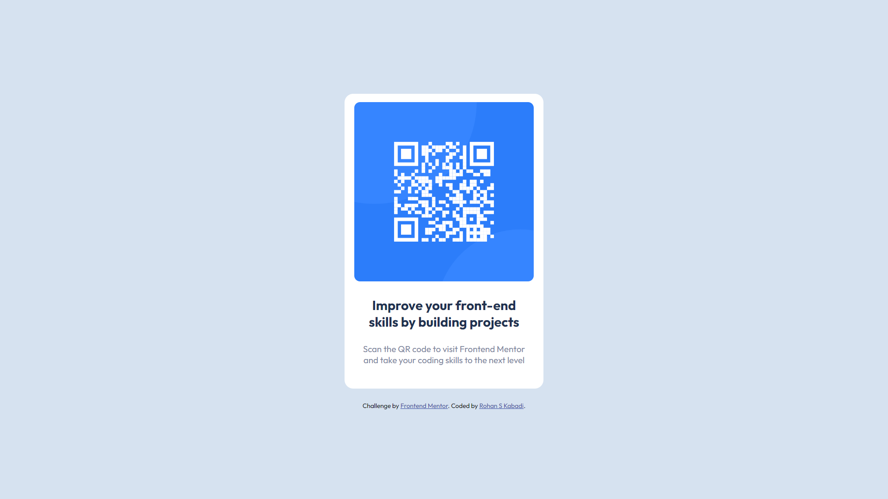

# Frontend Mentor - QR Code component solution

This is a solution to the [QR Code component challenge on Frontend Mentor](https://www.frontendmentor.io/challenges/qr-code-component-iux_sIO_H). Frontend Mentor challenges help you improve your coding skills by building realistic projects.

## Table of contents

- [Overview](#overview)
  - [The challenge](#the-challenge)
  - [Screenshot](#screenshot)
  - [Links](#links)
- [My process](#my-process)
  - [Built with](#built-with)
  - [What I learned](#what-i-learned)
  - [Continued development](#continued-development)
- [Author](#author)

## Overview

### The challenge

Users should be able to:

- View the optimal layout depending on their device's screen size

### Screenshot

### Links

- Live Site URL: [https://rohankbd.github.io/Product-card/](https://rohankbd.github.io/Product-card/)

## My process

### Built with

- Semantic HTML5 markup
- CSS custom properties
- CSS Grid

### What I learned

I learnt how to place different elements effectively using CSS custom properties and how it affects the behavior of other elements.
I advanced my knowledge about making sites responsive through this challenge.

### Continued development

I would like to further better this project in the future as I learn new styling techniques.

## Author

- Frontend Mentor - [@rohankbd](https://www.frontendmentor.io/profile/rohankbd)
